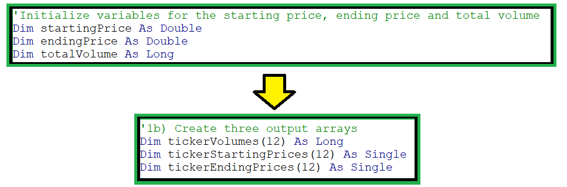
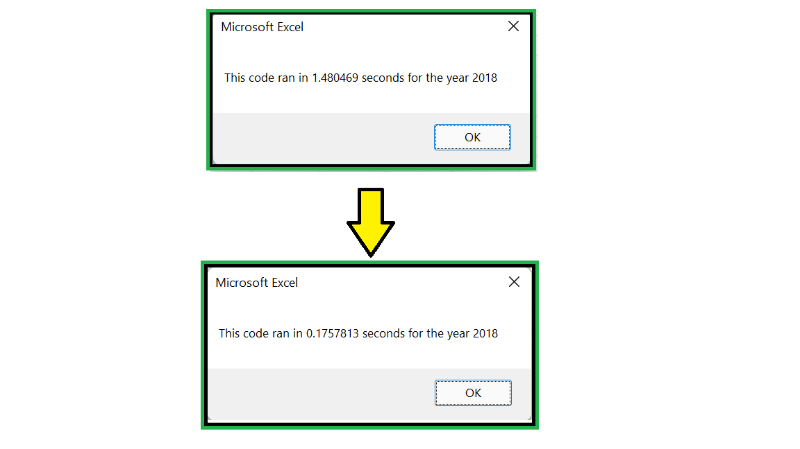

# Stocks-analysis (VBA exercise)

## Overview of Project

In this project, we were working on a Green energy stocks' data-set using VBA (Visual Basics for Application)
which is a programming language used to interact with Excel spreadsheets. We used VBA to create MACROs to read and
write into cells and worksheets, use complex logics to make calculations and to automate report building in order to
perform analysis in Excel.

### Purpose

The main purpose of the project was to study and compare various Green stocks with respect to their performance.
The analysis can be useful in selecting high performing Green energy stocks, which can be included in the portfolio
for investment. Furthermore, it was required to refactored the module 2 solution code and analyse and compare the
execution times before and after refactoring.

## Analysis

### Stock performance comparison

Stock trade Volume represents the number of shares of a stock that have changed hands over a certain
period of time. Stocks with higher volumes indicate that more investors are buying or selling them.
There is a relation between the stock trade volume and the price of the stock. Therefore, an analysis
of price and stock trade volume can be helpful for an investor to establish a better understanding of
the trends in stock price and any changes to it thereafter.

If a stock trading volume rises over a period of time, it means more people are buying the shares which is
pushing the stock price higher. One the other hand, if the price of a stock is falling whereas the stock trading
volume is rising over a period of time, it means more people are selling their shares.

However, if the stock price is increasing and the stock trading volume is decreasing over a period of time or
vice-versa, it suggests a lack of interest amongst people towards the stock. This means that stock price
trajectory is uncertain in future. In such a scenario, it might not be a good idea to buy that particular stock.

Considering the above explanation, following conclusions can be made from the given data:


**1.** ENPH and RUN seem to be high performing stocks since their total trading volume and return have
increased in both 2017 and 2018. This means more people are buying these stocks which has pushed their
prices up and generated higher returns.

**2.** DQ, HASI, SEDG, TERP and VSLR seem to be the stocks whose trading volume has increased between 2017-2018
but their returns have gone down. This means more people are selling these stocks which has pushed their prices
down and generated lower returns. However, SEDG stock returns have slightly decreased from 2017. So, it might
necessitate a deeper analysis.

**3.** AY, CSIQ, FSLR, JKS and SPWR stocks' returns and trading volume have decreased from 2017 to 2018. It seems
people are holding on to their shares in hand and are hoping to sell them when the stock prices increase.
The buyers are holding off and expecting the prices to hit a low point. This explains a lower trading volume.
The prices have gone lower due to lower trading volume. But again, other factors may need to be explored for
more accurate analysis.

### Execution performance comparison

In this challenge, we have refactored the module 2 solution code to loop through all the data one time in
order to collect the same information that we did earlier. Furthermore, we have found that refactoring the
code successfully made the VBA script run faster. We made following observations in this exercise:

- We have used a nested loop in the original module 2 solution code as follows:

```
Loop through tickers
    Loop through rows of data
        Calculation of total volume, starting price and ending price
    Loop End (for rows)
    Printing output on result worksheet 
Loop End (for tickers)
```

As we can see from above code block that we are iterating through the data "n" number of times, where n= number of tickers: 

```
Loop through tickers
    'a line of code will run here "n" number of times where n = number of tickers

    Loop through rows of data
        'a line of code will run here "n * number of rows" times

        Calculation of total volume, starting price and ending price
    Loop End (for rows)
    Printing output on result worksheet 
Loop End (for tickers)
```
The nested loop can be seen as below:


However, we have used a single loop in the refactored code as follows:

```
Loop through rows of data
    Calculation of total volume, starting price and ending price arrays
Loop End (for rows)

Loop through tickers
    Printing output on result worksheet
Loop End (for tickers) 
```
As we can see from above code block that we are iterating through the data only once. We then use a second loop to
print the results in the resultant worksheet using the populated output arrays:

```
Loop through rows of data
    'a line of code will run here "number of rows" times
    Calculation of total volume, starting price and ending price arrays
Loop End (for rows)

Loop through tickers
    'a line of code will run here "n" number of times, where n = number of tickers
    Printing output on result worksheet
Loop End (for tickers)
```
By refactoring the code, we have converted nested loop into a single loop over the rows of the data worksheet.
One iteration over the rows is taking less time than multiple iterations as seen in the original module 2 solution code.
In order to convert nested loop into a single loop we have used arrays to store output values. The refactored code can be seen
as below:


- Although we have saved time by converting nested loop into a single loop but we are required to make use
of arrays to store intermediate output values corresponding to each ticker. This means we are using more memory
in the refactored code as compared to the original module 2 solution code.



By refactoring the code, we have reduced the running time from 1.480 seconds to 0.167 seconds as displayed in the image below: 



## Advantages or disadvantages of refactoring code

### Advantages
 - While refactoring the code, we break the original code into separate logical blocks of code which makes it
 easier to read, understand and maintain. As the code gets larger and larger, it also grows in complexity and
 this is where it pays to organize code into small reusable and separate logical blocks.

 - Refactoring the code also allows us to get rid of redundant blocks of code and avoid processing of data which
 is not relevant to publish the final results. This provides a boost to the running time and overall efficiency of
 the code.

### Disadvantages
- It is not trivial to convert and refactor un-organized, complex and hard-to-understand code to organized,
well-structured and easy-to-understand code. This requires us to understand the context and functionality of
code completely before we can even start refactoring it which may take a lot of time and manpower.
 
- Refactoring of code also increases the chances of mistake. In case if anything goes wrong, a person will
have to invest much more time in debugging the issues and there are probable chances that it may go wrong due
to complexity of the code.

## Pros and Cons of refactoring the Stock Analysis Module 2 VBA script

### Pros

- While refactoring the code, we have separated the calculation logic and printing logic into different loops.
This has made the code easier to understand and debug.
In future, if we have to add any other calculations inside the spreadsheet, we can easily add the code for
those calculations inside the respective blocks without having to change at multiple places.

```
'Calculation logic
Loop through rows of data
    Calculation of total volume, starting price and ending price arrays
Loop End (for rows)

'Printing logic
Loop through tickers
    Printing output on result worksheet
Loop
```
- As part of refactoring, we have converted a nested loop into a single loop over the rows of data.
The given stocks' data was already sorted date-wise and all the stocks' data was grouped together for a
particular ticker. Due to this data pattern, it was redundant to loop over the all the rows of data for
each ticker. We could easily initialize a tickers array in the order of stocks that appear in the data
provided to us and then run a single loop over the rows to process various calculations. Once we have calculated
the total volume, starting price and ending price for one stock, it is not required to iterate over those set of
rows again. This refactor reduced the unnecessary iterations over the rows. This boosted the running time of the
refactored code versus the original code.

### Cons

- To refactor the code, we have created tickers array specific to the given data-set, which cannot be applied for
different data-set. If the same code will be applied on a data-set which is not in sorted form and not grouped together,
code cannot be reused as-is.

